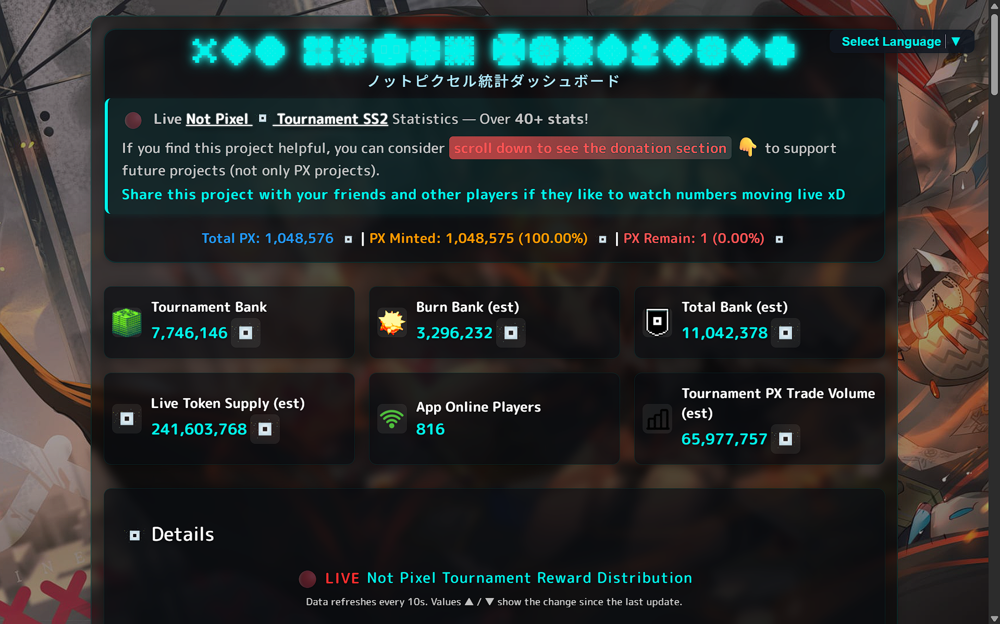
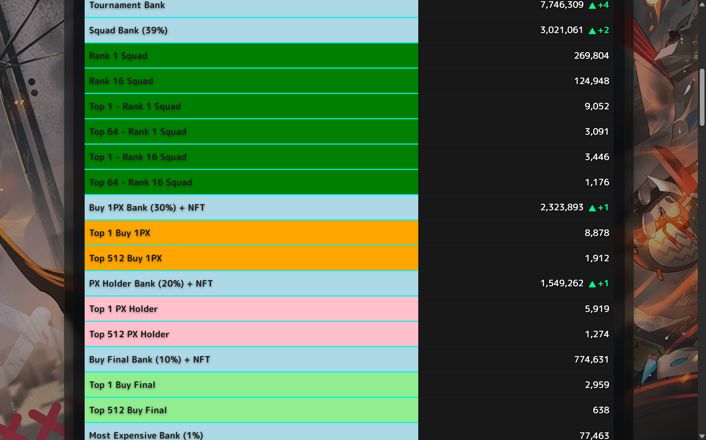
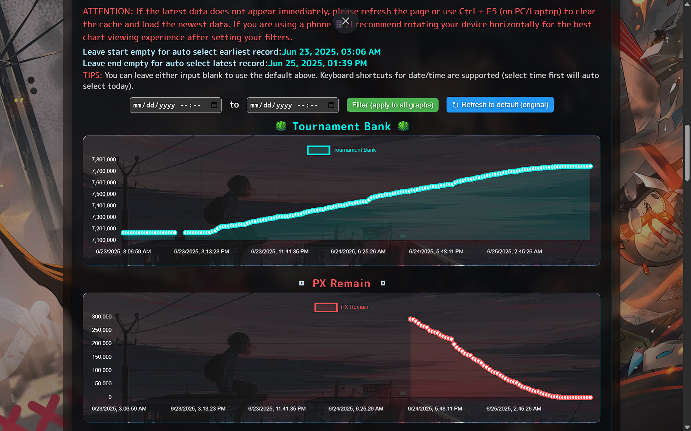
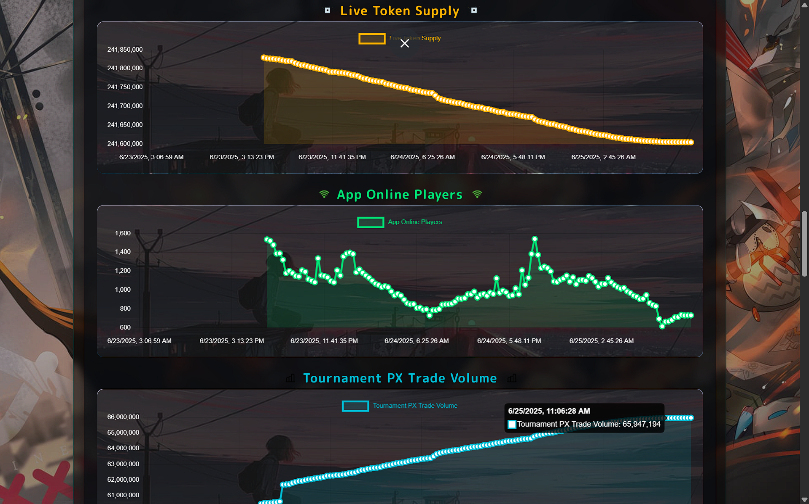
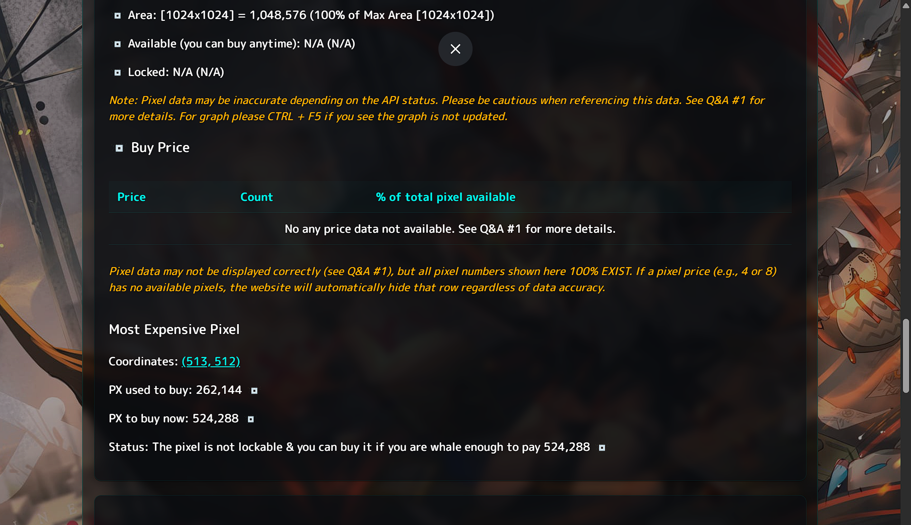
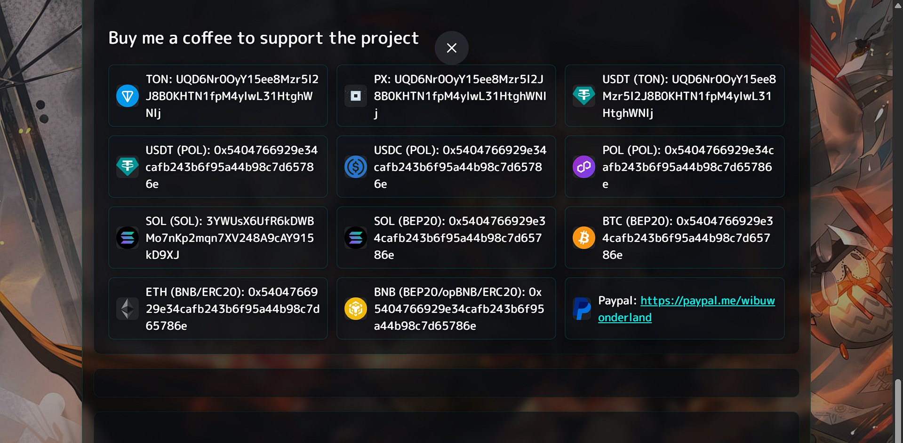
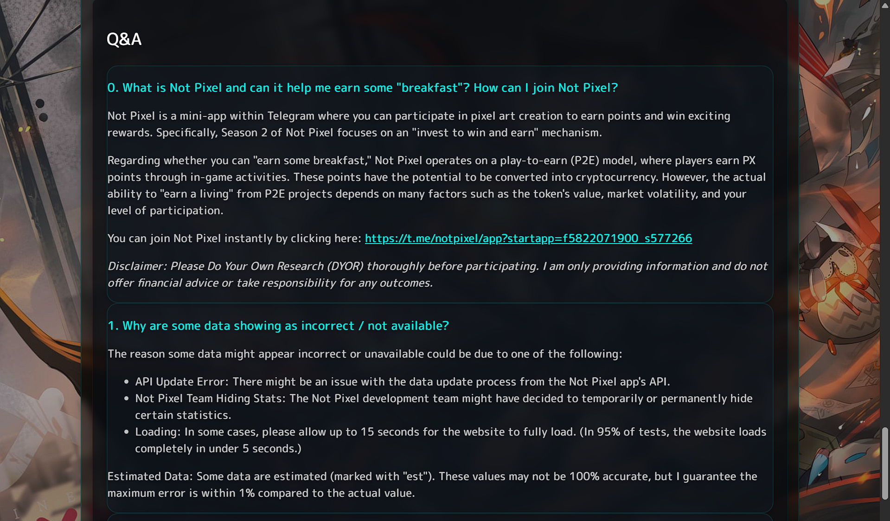
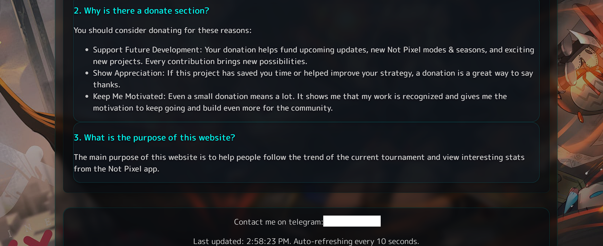

# Not Pixel Tournament SS2 Dashboard Snapshot

## 🙏 Support the Project (Donate)

If you find this project helpful and want to support future development, please consider donating! You can donate using the methods below (see more options on the website):

- **TON**  
  `UQD6NrO0yY15ee8Mzr5I2J8B0KHTN1fpM4ylwL31HtghWNlj`
- **PX**  
  `UQD6NrO0yY15ee8Mzr5I2J8B0KHTN1fpM4ylwL31HtghWNlj`
- **USDT (TON)**  
  `UQD6NrO0yY15ee8Mzr5I2J8B0KHTN1fpM4ylwL31HtghWNlj`

_Every donation helps keep the project alive and brings new features for the Not Pixel community!_

---

## 📦 Project Snapshot

This is a snapshot of the Not Pixel Tournament SS2 statistics dashboard project. Keeping this snapshot helps prevent data loss and makes it easy to restore or reference the project in the future.

---

## 📸 Project Images

---

> _This snapshot was created for backup and reference purposes. All images above are taken from the current state of the project._
